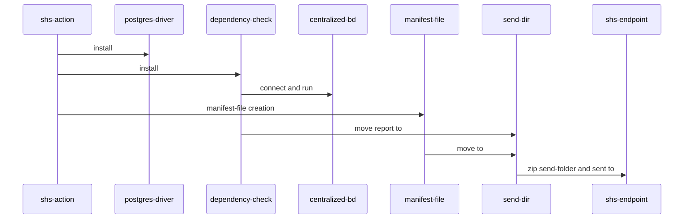

# SHS Analyser GitHub Action

GitHub Action that handles security scans using dependency-check and publish output to SHS service

## Inputs

- `db_user`: Database username (*required*)
- `db_password`: Database password (*required*)
- `connection_string`: Database connection string (*required*)

You should save create a secret for user (not crucial) and a secret for password (crucial). 

## Trigger

This action should runs on tag creation.

## Job

The job `analyze` runs on the latest version of Ubuntu.

### Steps for the action to work. 

1. Set up Git repository using `actions/checkout@v4`. (This is crucial and should be done in the workflow) 
2. Install Dependency-Check CLI.
3. Get the postgres driver for the database.
4. Run dependency-check with the inputs parameters.
5. Move the .json report file to "send-dir".
6. Create a simple manifest file and move to "sent-dir". 
7. Zip "sent-dir" and send it to SHS API.


#### Sequence diagram.



### Workflow example. 
```yaml
   name: shs-action

   on:
     workflow_dispatch:
     push:
       tags:
         - '*'
   jobs:
     release:
       runs-on: ubuntu-latest

       steps:
         - uses: actions/checkout@v4

         - name: Print DB User and Password
           run: |
             echo "DB User: ${{ secrets.DB_USER }}"
             echo "DB Password: ${{ secrets.DB_PASSWORD }}"

         - name: Run SHS Analyser
           id: shs-analyser
           uses: isel-leic-shs/shs-action@main
           with:
             db_user: ${{secrets.DB_USER }}
             db_password: ${{secrets.DB_PASSWORD}}
             connection_string: "jdbc:postgresql://7.tcp.eu.ngrok.io:12032/dependencycheck?currentSchema=public" 
  ```
