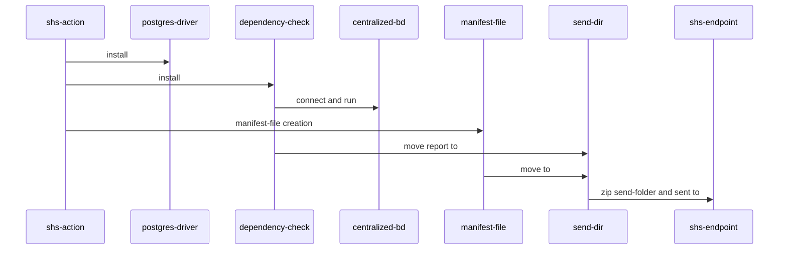

# SHS Analyser GitHub Action

GitHub Action that handles security scans using dependency-check and publish output to SHS service


## Env 
- `api_token`: SHS API token (*required*) with secret name `SHS_API_TOKEN`
- `db_user`: Database username (*required*) with secret name `SHS_DB_USER`
- `db_password`: Database password (*required*) with secret name `SHS_DB_PASSWORD`

## Inputs
- `connection_string`: Database connection string (*required*)

You should save create a secret for user (not crucial) and a secret for password (crucial). 

## Outputs 
- `dependency_check_report`: Report directly from the CLI scan
## Trigger

This action should runs on tag creation.

## Job

* The job should runs on  Ubuntu (e.g. ubuntu-latest).
* The github checkout should be done in the directory `porject`.
So it is mandatory to set the input `path: "project"` in the `actions/checkout@v4`
* The job include a extra step for nodejs, angular and react projects. 
* In the last step of the action we save the report in the action `Artifacts`

### Steps for the action to work. 

1. Set up Git repository using `actions/checkout@v4`. (This is crucial and should be done in the workflow) 
2. Install Dependency-Check CLI.
3. Get the postgres driver for the database.
4. Run dependency-check with the inputs parameters.
5. Move the .json report file to "send-dir".
6. Create a simple manifest file and move to "sent-dir". 
7. Zip "sent-dir" and send it to SHS API.


#### Sequence diagram.



### Workflow example for maven and gradle projects. 
```yaml
name: shs-action

on:
  workflow_dispatch:
  push:
    tags:
      - '*'
jobs:
  release:
    runs-on: ubuntu-latest
    steps:
      - uses: actions/checkout@v4
        with:
          path: "project"

      - name: Run SHS Analyser
        id: shs-analyser
        uses: isel-leic-shs/shs-action@main
        env:
          db_user: "${{secrets.SHS_DB_USER}}"
          db_password: "${{secrets.SHS_DB_PASSWORD}}"
          shs_token: "${{secrets.SHS_API_TOKEN}}"

      - name: Print github information
        run: cat "${{ steps.shs-analyser.outputs.repository_info}}"

      - name: Upload the Dependency-Check report
        uses: actions/upload-artifact@v2
        with:
          name: dependency check-report
          path: "${{steps.shs-analyser.outputs.dependency_check_report}}"
  ```

### Workflow example for projects based on package.json like react, nodejs and angular.
```yaml
name: shs-action
on:
  workflow_dispatch:
  push:
    tags:
      - '*'
jobs:
  release:
    runs-on: ubuntu-latest
    steps:
      - uses: actions/checkout@v4
        with:
          path: "project"

      - name: Install npm
        working-directory: project
        run: npm install

      - name: Run SHS Analyser
        id: shs-analyser
        uses: isel-leic-shs/shs-action@main
        env:
          db_user: "${{secrets.SHS_DB_USER}}"
          db_password: "${{secrets.SHS_DB_PASSWORD}}"
          shs_token: "${{secrets.SHS_API_TOKEN}}"

      - name: Print github information
        run: cat "${{ steps.shs-analyser.outputs.repository_info}}"

      - name: Upload the Dependency-Check report
        uses: actions/upload-artifact@v2
        with:
          name: dependency check-report
          path: "${{steps.shs-analyser.outputs.dependency_check_report}}"
  ```